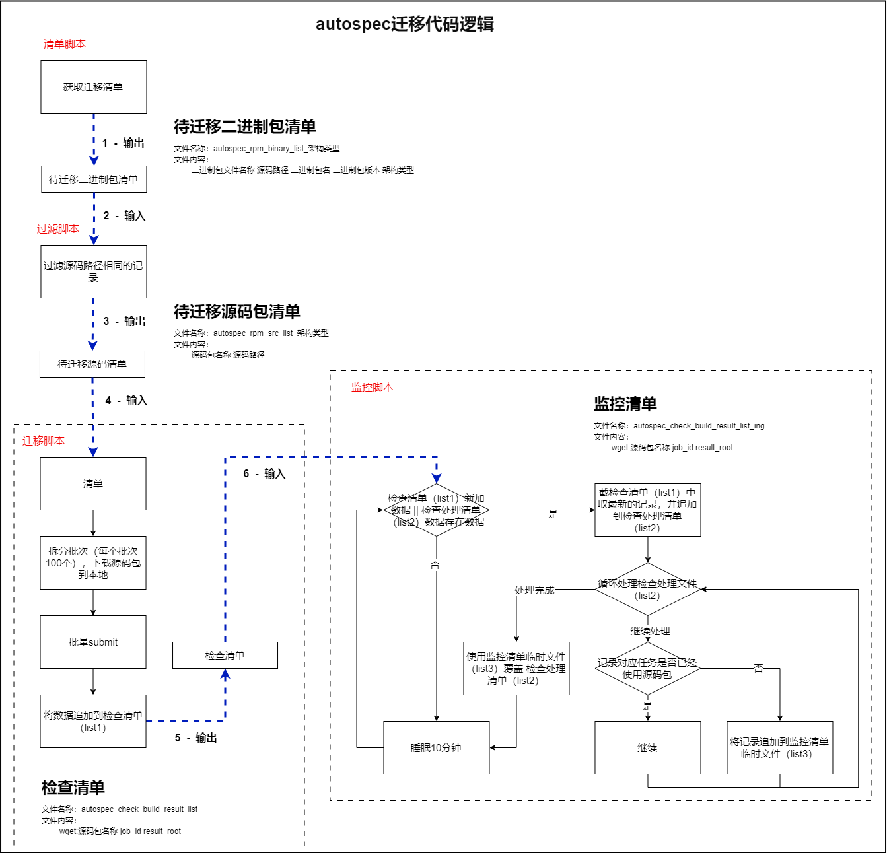
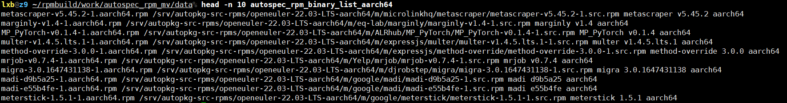
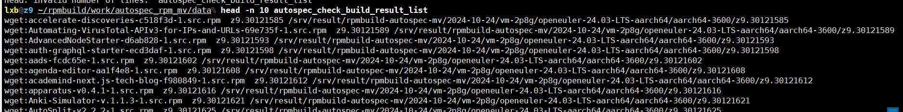
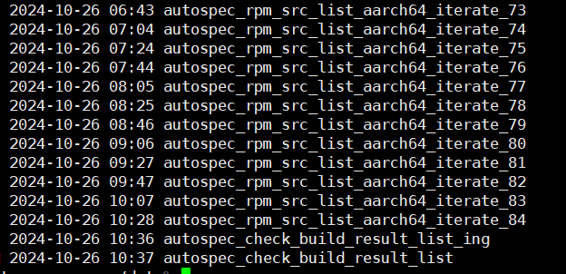
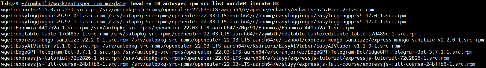

# 1 autospec包批量迁移

> autospec包迁移，是将autospec服务器上存在的rpm源码包进行重新迁移构建，并提交至z9的源仓库.

## 1.1 流程图



## 1.2 脚本说明

### 1.2.1 迁移清单脚本

- **脚本名称**：get_autospec_rpm_list.sh
- **功能描述**：根据指定架构类型获取对应架构的待迁移清单

#### 1.2.1.1 使用说明

- **执行说明**
   （需要在autospec服务器上执行）
</br>

- **手动设定参数**

   ```shell
   # 需要指定架构类型
   arch_type="x86_64"

   # 指定输出的清单文件名称 ，以及路径（默认在当前路径）
   rpm_list_file="autospec_rpm_binary_list_${arch_type}"
   
   # 指定autospec服务器上的系统级目录
   os_version_dir="openeuler-22.03-LTS-${arch_type}"

   # autospec服务器：二进制包路径
   rpm_binary_path="/srv/autopkg-rpms/${os_version_dir}"

   # autospec服务器：源码包路径
   rpm_src_path="/srv/autopkg-src-rpms/${os_version_dir}"
   ```

#### 1.2.1.2 输入

> 无参数输入

#### 1.2.1.3 输出

1. **待迁移二进制包清单文件**
   - **文件名称**：

      ```text
      autospec_rpm_binary_list_架构类型
      ```

   - **内容格式**：

      ```text
      二进制包名 源码包路径 二进制包basename 二进制包版本 架构l裂隙
      ```

   - **文件样例**：
      

### 1.2.2 过滤脚本

- **脚本名称**：filter_autospec_rpm_list.sh
- **功能描述**：待迁移二进制包清单中记录存在源码包路径相同的情况，为减少job提交次数，对源码包路径相同的记录进行去重

#### 1.2.2.1 使用说明

- **手动设定参数**

   ```shell
   # 需要指定架构类型
   arch_type="x86_64"

   # 源清单（也可以直接写定，不需要架构类型）
   rpm_list_file_src="data/autospec_rpm_binary_list_${arch_type}"
   # 输出清单（也可以直接写定，不需要架构类型）
   rpm_list_file_des="data/autospec_rpm_src_list_${arch_type}""
   ```

#### 1.2.2.2 输入

> 无参数输入

#### 1.2.2.3 输出

1. **待迁移二进制包清单文件**
   - **文件名称**：

      ```text
      autospec_rpm_src_list_架构类型
      ```

   - **内容格式**：

      ```text
      源码包名 源码包路径
      ```

   - **文件样例**：
      

### 1.2.3 批量迁移脚本

- **脚本名称**：autospec_rpm_mv.sh
- **功能描述**：
  - **拆分**：将待迁移清单，拆分为多个小批量（每个小批量100个源码包，方便下载、提交、监控），并使用scp将记录对应源码包从autospec服务器下载到z9指定目录；
  - **批量提交**：一个小批量拆分后，调用submit进行批量提交；同时在批量提交完成后，会将当前小批次的结果路径信息，追加到检查清单中，供源码包删除监控脚本使用；
  - **数量控制**：如果z9服务器存储的源码包，超过4000，则会一直等待源码包被删除（人工删除、监控脚本删除）后，再继续，防止存储空间不足；

#### 1.2.3.1 使用说明

- **手动设定参数**

   ```shell
   # 项目基础路径
   base_path="${home}/work/autospec_rpm_mv"

   # 待迁移的源码包清单，以及迭代中的小批量文件名前缀
   src_list="${base_path}/data/autospec_rpm_src_list_aarch64"
   iterarte_list="${src_list}_iterate"

   # 架构类型（批量提交的时候，需要指定的参数）
   arch_type="aarch64"

   # 当前迁移的log日志位置（当前脚本的运行日志）
   log_dir_name=$(basename ${src_list})
   project_log_file="${base_path}/log/log-${log_dir_name}"

   # 下载的源码包存放的位置（z9）
   src_rpm_path_dest="/srv/result/rpmbuild-test-lxb/tmp/"
   ```

- **日志存放路径**
  - 当前脚本运行日志：由代码中指定路径
  - 批量提交日志：${base_path}/log/submit-log-${log_dir_name}
    - 包含两个日志文件：批量提交日志，任务提交成功文件，任务提交失败文件 （***具体可参考批量提交部分***）

#### 1.2.3.2 输入

> 无参数输入

#### 1.2.3.3 输出

1. **检查文件**
   - **文件名称**：

      ```text
      autospec_check_build_result_list
      ```

   - **内容格式**：

      ```text
      wget:源码包名 构建任务id(job_id) 构建任务结果目录(result_root)
      ```

   - **文件样例**：
      

2. **小批量提交清单**
   - **文件名称**：

      ```text
      autospec_rpm_src_list_aarch64_iterate_迭代序号"
      ```

   - **内容格式**：（增加wget，用于执行机run脚本识别源码来源）

      ```text
      wget:源码包名 源码包路径
      ```

   - **文件样例**：
      
      

### 1.2.4 监控脚本

- **脚本名称**：autospec_check_rpm_build.sh
- **功能描述**：
  - **获取监控内容**：根据记录的上一次截取位置，截取检查清单最新的记录，并追加到监控清单中；
  - **监控**：循环处理监控清单，针对每一条记录，检查对应日志中是否有源码包已经使用过标志，如果存在，则删除源码包；

#### 1.2.4.1 使用说明

- **手动设定参数**

   ```shell
   # 项目基础路径
   base_path="${home}/work/autospec_rpm_mv"

   # 指定迁移输出的检查清单
   src_list="${base_path}/data/autospec_check_build_result_list"

   # 当前脚本运行日志文件
   project_log_file="${base_path}/log/log-delete_autospec_rpm"

   # 下载的源码包保存的路径（z9）
   wget_rpm_path="/srv/result/rpmbuild-test-lxb/tmp"

   # 构建过程中，执行机中wget之后会打印的日志，日志文件中存在这个标志，则可以删除源码包
   wget_rpm_flag="[log] src rpm from wget succ."

   # 监控清单，以及临时文件
   proc_file="${src_list}_ing"
   proc_file_tmp="${src_list}_ing_tmp"
   ```

- **日志存放路径**
  - 当前脚本运行日志：由代码中指定路径
  - 批量提交日志：${base_path}/log/submit-log-${log_dir_name}
    - 包含两个日志文件：批量提交日志，任务提交成功文件，任务提交失败文件 （***具体可参考批量提交部分***）

#### 1.2.4.2 输入

> 无参数输入

#### 1.2.4.3 输出

1. **监控文件**
   - **文件名称**：

      ```text
      autospec_check_build_result_list_ing
      ```

   - **内容格式**：

      ```text
      wget:源码包名 构建任务id(job_id) 构建任务结果目录(result_root)
      ```
