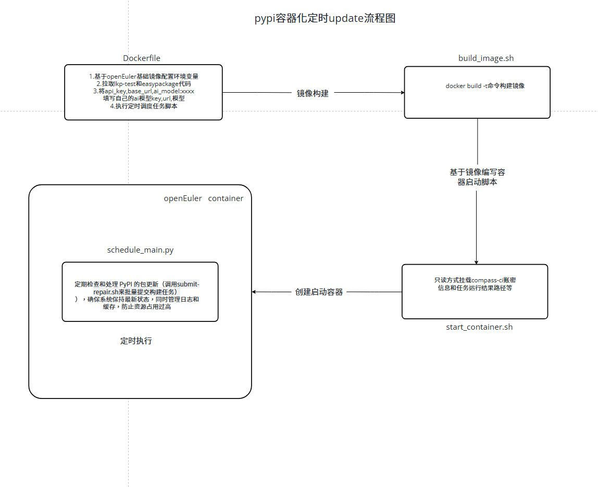
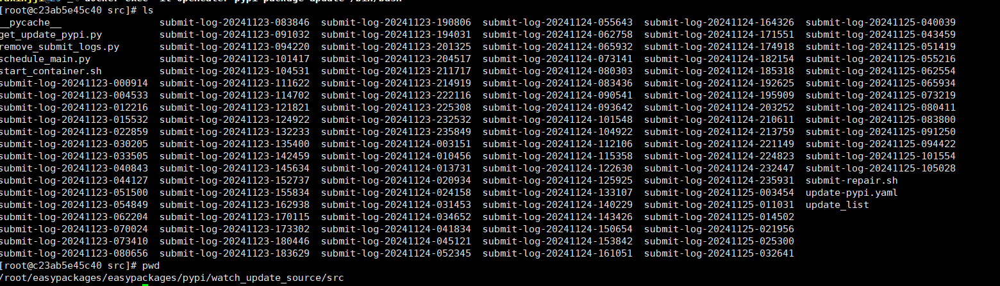

# pypi容器化定时update

### 流程图

### 脚本说明

#### Dockerfile文件
**作用：用于构建一个基于OpenEuler 22.03 LTS的Docker镜像，其主要功能是设置环境、安装所需的依赖包、克隆相关的代码库，并准备运行一个Python脚本**

1. 使用OpenEuler 22.03 LTS作为基础镜像，并命名为 BUILDER 阶段
2. 设置工作目录为 /root，后续所有命令将在此目录下执行
3. 使用 sed 命令修改 openEuler.repo 文件，以更换软件源为南京大学的镜像。删除了与 metalink 和 metadata_expire 相关的行，以优化yum的配置。
4. 设置多个环境变量： 扩展 PATH 环境变量以包含LKP相关的可执行文件路径。 设置Python包安装的源为阿里云的PyPI镜像，以加速安装
5. 安装了一系列开发工具和库，克隆两个 Git 仓库，一个是 LKP-test代码，另一个是 EasyPackages 项目
6. 使用sed命令修改update-pypi.yaml里面的，api_key,base_url,ai_model值，填写自己的ai模型key,url,模型
7. 切换到 EasyPackages 项目的特定工作目录,启动指定的 Python 脚本 schedule_main.py

#### build_image.sh
**作用：通过Dockerfile文件，构建定制化的用于pypi定时update的容器镜像**

1. 使用当前工作目录中的Dockerfile构建一个名为**openeuler-pypi-package-update**的Docker镜像

#### start_container.sh
**作用：基于定制化的用于pypi定时update的容器镜像，创建并启动容器实例**

1. 定义环境变量：设置 CCI_SRC 为 /c/compass-ci，指定 Compass CI 的源目录
2. 加载配置文件：使用 source 命令加载 defconfig.sh 脚本，以获取必要的变量和函数
3. 删除现有容器：调用 docker_rm 函数，删除名为 openeuler-pypi-package-update 的Docker容器
4. 加载默认设置和认证信息：调用 load_cci_defaults 和 load_service_authentication 函数，设置默认配置和服务认证信息
5. 构建 Docker 运行命令：定义一个数组 cmd，包含运行 Docker 容器所需的各项参数，包括容器名称、运行模式、挂载的卷等
6. 执行 Docker 命令：最后，通过 "${cmd[@]}" 执行之前构建的 Docker 命令，以启动新的容器

#### schedule_main.py
**作用：程序启动后，每隔 30 分钟，检查是否有新的更新包。如果有，它们将被处理并构建。任务完成后，相关的日志也会被清理**

1. 初始化环境: 程序开始时，定义一些全局变量，例如 task_running（标志当前任务是否正在运行） 和 update_cache（存储已处理的包名称以避免重复处理）
2. 主函数启动: 执行 main() 函数，通过调用 schedule.every(30).minutes.do(run_update_task) 设置一个定时任务，每 30 分钟执行一次 run_update_task() 函数
3. 无限循环：进入一个无限循环 while True: 中，持续检查是否有待运行的调度任务，使用 schedule.run_pending() 检查并执行所有到期的调度任务，如果没有任务在运行（通过 check_process_running() 检查），则程序将继续等待 3 秒钟再重新检查
4. 执行更新任务 (run_update_task()):设置 task_running 为 True，标记任务正在运行，调用 clear_update_cache(update_cache) 清理缓存，以防止重复处理过多的包，
使用 get_update_content(update_cache) 获取当前更新的包，并将其保存到文件。这会生成一个包含更新包名称的文本文件，存放在 update_list 目录中，
成功获取到的更新列表文件，调用 exec_submit_build_job(list_file)，执行提交构建作业的 Shell （submit-repair.sh）命令，调用 remove_submit_logs.remove_logs_dirs() 清理相关日志，将 task_running 设置为 False，表示任务结束
5. 周期性检查和处理:每 30 分钟，程序会重复上述流程，持续监控 PyPI 更新，并执行相应的构建作业

### 使用说明

1. z9环境克隆github代码需要添加代理，克隆easypackages最新代码仓到本地（git clone https://ghp.ci/https://github.com/opensourceways/easypackages.git）
2. 找到easypackages/easypackages/pypi/watch_update_source/Dockerfile文件，修改api_key,base_url,ai_model:xxxx填写自己的ai模型key,url,模型
3. 切换到easypackages/easypackages/pypi/watch_update_source下，执行命令：bash build_image.sh构建镜像
4. 执行同级目录下的脚本start_container.sh，执行命令： bash start_container.sh创建并启动容器
5. 执行docker exec -it openeuler-pypi-package-update /bin/bash进入容器，查看执行情况和日志记录
6. 容器内日志查看路径：/root/easypackages/easypackages/pypi/watch_update_source/src
7. 日志命名是以：迁移系统名字+迁移架构+迁移日期保留的文件夹：如图
   
8. 进入其中一个日志文件，result_root_list：保留了当前提交job任务的所有的结果路径。submit-log：记录提交这批任务的提交记录。submit-succ-list：记录提交成功任务清单。submit-fail-list：记录提交失败的任务清单（如果有失败的才会生成这个文件）
9. 对这些日志想要清晰了解，可以查看rpm_package_transfer目录下的rpm_package_transfer流程图.png