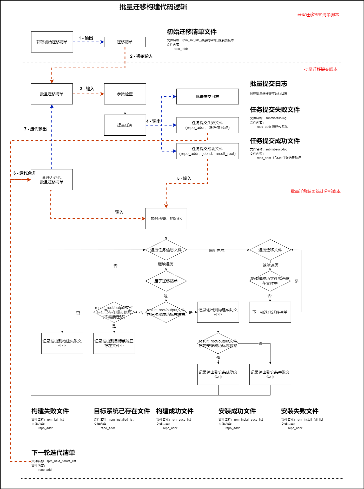
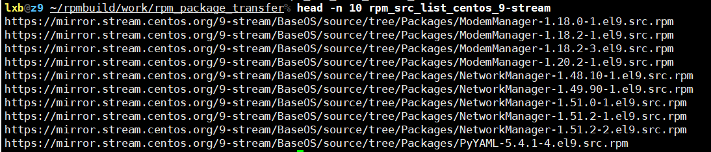
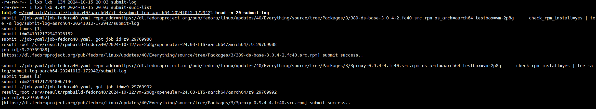
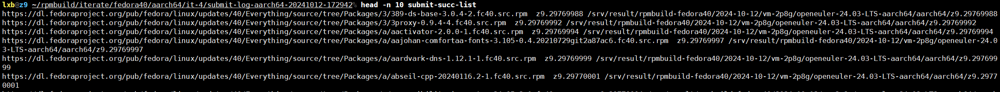

# 1 autospec包批量迁移

> autospec包迁移，是将autospec服务器上存在的rpm源码包进行重新迁移构建，并提交至z9的源仓库.

## 1.1 流程图



## 1.2 脚本说明

### 1.2.1 初始清单脚本

- **脚本名称**：get_rpm_transfer_list.sh
- **功能描述**：
  - 根据rpm源仓的元数据信息文件列表，下载元素据信息文件，并过滤出待迁移源码包清单；

#### 1.2.1.1 使用说明

- **执行说明**
  - 配置文件：
    - rpm_package_transfer/rpm_transfer/repo_cfg.sh：其中指定变量代表的rpm源码仓元数据文件
    - 其中的变量会直接在get_rpm_transfer_list.sh中使用
  - 工具：
    - 过滤元数据文件工具（python）：rpm_package_transfer/rpm_transfer/utils/getRpmSourceList.py

- **手动设定参数**

   ```shell
   # 基础路径
   base_path="./"

   # 源仓元数据信息文件列表
   # rpm_src_xlm_urls可设置的值在./rpm_transfer/repo_cfg.sh文件中配置
   rpm_src_xlm_urls="${src_xlm_url_centos_9[*]}"

   # 源系统名称、版本，用于区分迁移清单
   src_os_name="centos"
   src_os_version="9-stream"

   # 批量迁移初始清单
   rpm_src_list_name="rpm_src_list_${src_os_name}_${src_os_version}"
   ```

#### 1.2.1.2 输入

> 无参数输入

#### 1.2.1.3 输出

1. **批量迁移初始清单文件**
   - **文件名称**：

      ```text
      rpm_src_list_源系统名称_源系统版本
      ```

   - **内容格式**：

      ```text
      源码包下载链接
      ```

   - **文件样例**：
      

### 1.2.2 批量迁移提交脚本

- **脚本名称**：submit_batch_rpm.sh
- **功能描述**：
  - 根据输入的批量迁移清单，以及指定相关参数，自动批量提交job去构建源码包；

#### 1.2.2.1 使用说明

- **执行说明**
***在本地执行即可，并输入相关需要的参数***
</br>

- **输入参数说明**
  
   ```text
    # 必须指定参数
    -l: (list) 指定批量list文件. (default file ./list)
        文件格式要求：(如无其它参数，可忽略其他参数部分)
            repo_addr 其他参数1 其他参数2 ...
    -h: 指定架构
        可选值：aarch64、x86_64
    -t: 指定执行机规格
        可选值：vm-2p16g、vm-2p8g、vm-4p32g ...
    -y: 指定job-yaml文件
    -g: 指定日志路径
        指定运行此脚本时，输出的日志保存路径

   # 可选参数
   -r: 指定repo_base_addr
        使用此参数，在提交job时，提交的repo_addr会加上此前缀
        例如：
            原repo_addr="aa/bb/cc", repo_base_addr="https://basepath/xx/"
            则提交job时，repo_addr="https://basepath/xx/aa/bb/cc"

    # 功能参数
    -p：指定其他自定义参数 （check_rpm_install=yes res_file_exten=.fc40）
        check_rpm_install：（yes/no）是否检查待迁移rpm包以及存在
        res_file_exten：生成的源码包、二进制包需要添加额外的标记
    -a: (ai) 使用AI修复spec文件
         可选值: before/build/all
            before: 在rpm build之前使用ai修复（必须上送spec、log文件）
            build：如果rpm build构建失败，使用ai修复spec文件
            all: 在rpm build之前、构建失败时，都会使用ai修复spec文件（必须上送spec、log文件）
    -s: (src) 是否使用本地文件替换构建过程的文件
        可选值：spec、log、spec_log
        存在spec，则表示上送spec文件
        存在log，则表示上送log文件
    -d: (dir) 如果指定-s，则需要指定存放本地源文件的目录 (包含 specs/logs/sources).
        spec文件和log文件是对应的
    -m: (mapping) 包名映射修复
        值：指定rpm特征文件修复spec文件（feature mapping file）
    -o：(other) 其他参数，多个参数以 “+” 分割
            例如:param_1+param_2+param_3
   ```

</br>

- **支持功能介绍**
  - **已存在rpm包检查**
    - 功能介绍：加上次参数，会在执行机中检查目标系统源中是否存在当前待构建的包名+版本，如果存在，不不会再次构建；否在才会构建

    ```shell
    rpmbuild_run_check()
    {
        # 检查rpm包是否已经存在了
        if [ -n "${check_rpm_install}" ] && [ "${check_rpm_install}" = 'yes' ]; then
            if [ -z "$repo_addr" ]; then
                echo "[error] repo_addr is empty [${repo_addr}], do not check whether it is already     installed."
                return 0
            fi
    
            tmp_file="${rpmbuild_result_path}/tmp_file"
            tmp_rpm_name_version=""
            tmp_rpm_name=""
            tmp_rpm_version=""
            if [[ "${repo_addr##*.}" = "rpm" && "${repo_addr}" =~ ^http ]]; then
                # 源码仓获取 (带版本)
                tmp_rpm_name_version=$(echo "${repo_addr}" | awk -F'/' '{print $NF}' | awk -F'-' '{for(i=1; i<NF;i++){printf("%s-",$i)};print ""}' | sed 's/-$//')
                tmp_rpm_version=$(echo "${tmp_rpm_name_version}" | awk -F'-' '{print $NF}')
                tmp_rpm_name=${tmp_rpm_name_version%%${tmp_rpm_version}}
                tmp_rpm_name=${tmp_rpm_name%-}
            elif [[ "${repo_addr##*.}" = "git" ]]; then
                # git仓库获取 （不带版本）
                tmp_rpm_name_version=$(echo "${repo_addr}" | awk -F'/' '{print $NF}' | awk -F'\\.git' ' {print $1}')
                tmp_rpm_name=${tmp_rpm_name_version}
            else
                echo "[error] repo_addr error [${repo_addr}], do not check whether it is already installed."
                return 0
            fi
            echo "[log] [${tmp_rpm_name_version}]-[${tmp_rpm_name}]-[${tmp_rpm_version}]"

            # 查询软件包信息
            yum info "${tmp_rpm_name}" > ${tmp_file} 2>&1
            echo "---------yum info-----------"
            cat ${tmp_file}
            echo "----------------------------"

            if ! grep -q "Name.*:.*${tmp_rpm_name}" ${tmp_file}; then
                # 没有匹配到rpm包名称，将进行build
                echo "[log] no match[${tmp_rpm_name_version}], will install "
                return 0
            else
                # 匹配到rpm包名称
                if [ -n "${tmp_rpm_version}" ]; then
                    if ! grep -q "Version.*:.*${tmp_rpm_version}" ${tmp_file}; then
                        # 没有匹配到对应版本，将进行build
                        echo "[log]: match rpm[${tmp_rpm_name}], but no match[${tmp_rpm_name_version}], will install "
                        return 0
                    fi
                fi
            fi

            # if rpm exist, will exit.
            echo "[log] [${tmp_rpm_name_version}] installed ..."
            echo "[log] success, rpm already installed"
            exit 0
        fi
    }
    ```

  - **生成包后缀扩展**
    - 功能介绍：会在生成的源码包、二进制包文件名加上扩展后缀

    ```text
    # run脚本
    rpmbuild -ba ${spec_dir}/*.spec ${res_rpm_file_exten} 2>&1
    ```

  - **AI修复**
    - 功能介绍：支持rpmbuild前、后、前后AI修复（但是建议是使用构建一次再使用ai修复，即rpmbuild后AI修复）
    - 参数说明：

        ```text
        -a：需要使用-a指定在流程中何处使用AI修复（可选值: before/build/all）
            before: 在rpm build之前使用ai修复（必须上送spec、log文件）
            build：如果rpm build构建失败，使用ai修复spec文件
            all: 在rpm build之前、构建失败时，都会使用ai修复spec文件（必须上送spec、log文件）

        -s: 指定本地是否上传spec、log文件替换执行机中的spec或log，一次有效（在构建前替换一次）
        可选值：spec、log、spec_log
            存在spec，则表示上送spec文件
            存在log，则表示上送log文件

        -d: (dir) 如果指定-s，则需要指定存放本地源文件的目录 (包含 specs/logs/sources).
            spec文件和log文件是对应的
        ```

  - **包名映射**（***目前只是修复了BuildRequires，未对Requires场景进行修复***）
    - 功能介绍：在下载依赖失败后，会使用包名映射修复spe文件
    - 参数说明：参数值为本地的包名映射文件，在提价job时，会自动打包传到执行机
</br>

- **其他参数介绍**
  - -o
    - 功能介绍：使用-o指定，使用"+"作为标签的分隔符，根据迁移清单记录中的第2列开始的数据依次序对每个标签进行赋值
    - 案例

        ```text
        # 命令
        sh submit_batch_rpm.sh -o tag1+tag2

        # 迁移清单记录样式
        https://dl.fedoraproject.org/pub/fedora/linux/updates/40/Everything/source/tree/Packages/   3/389-ds-base-3.0.4-2.fc40.src.rpm data1 data2

        # 提交job时的命令 (...表示其他参数信息，未写明)
        submit ... tag1=data1 tag2=data2 ...
        ```

- **手动设定参数（脚本中）**：

    ```shell
    # 提交500个任务后，会休眠的时间，防止提交任务太多阻塞
    sleep_time=3600

    # submit最大提交次数(submit提交任务失败后，会进行重试)
    submit_max_times=5
    ```

</br>

- **执行案例**
  - 提交批量任务

    ```shell
    # 迁移清单数据样例
    Packages/mkfontscale-1.2.1-3.el9.src.rpm data1 data2 data3

    # 批量迁移执行命令案例
    sh submit_batch_rpm.sh \
        -l ./centos_9-stream_list \
        -h "aarch64" \
        -t "vm-2p8g" \
        -y ./job_yaml/job-centos9.yaml \
        -g ./log \
        -r "https://mirror.stream.centos.org/9-stream/AppStream/source/tree/"
        -p "check_rpm_install=yes res_file_exten=.el9" \
        -a "before"
        -s "spec"
        -d ./SOURCE
        -m ./src_mapping_binary_centos_to_openeuler_aarch64
        -o "tag1+tag2"
    ```

  - 提交job时的submit

    ```shell
    submit job-centos9.yaml repo_addr=https://mirror.stream.centos.org/9-stream/AppStream/source/tree/Packages/mkfontscale-1.2.1-3.el9.src.rpm os_arch=aarch64 testbox=vm-2p8g repair_spec=mkfontscale.spec repair_log=mkfontscale.log ai_repair_spec=before repair_spec_by_mapping=src_mapping_binary_centos_to_openeuler_aarch64  check_rpm_install=yes res_file_exten=.el9 tag1=data1 tag2=data2 | tee -a log/submit-log-aarch64-20240822-115001
    ```

</br>

#### 1.2.2.2 输入

  &nbsp;&nbsp;&nbsp;&nbsp;***见上述说明***

#### 1.2.2.3 输出

1. **批量迁移执行日志**
   - **文件名称**：

      ```text
      submit-log
      ```

   - **内容格式**：(记录job提交命令，以及提交过程日志)

   - **文件样例**：
      

2. **任务提交成功**
   - **文件名称**：

      ```text
      submit-succ-log
      ```

   - **内容格式**：

      ```text
      源码包下载链接 任务id 任务日志路径
      ```

   - **文件样例**：
      

3. **任务提交失败成功**
   - **文件名称**：

      ```text
      submit-faillog
      ```

   - **内容格式**：

      ```text
      源码包下载链接
      ```

   - **文件样例**：

</br>

### 1.2.3 批量迁移结果分析脚本

- **脚本名称**：refine-batch-submit-result-jobid-new.sh
- **功能描述**：
  - **结果分析**：根据批量迁移的任务提交成功文件（包含结果路径），进行遍历，检查任务运行结果，并生成构建成功清单、构建失败清单、目标系统已存在清单，对于构建成功清单
  - 针对一个批次构建结果进行分析，并输出相关结果文件；
  - **生成下一迭代迁移清单**：相对批量迁移源清单，在目标系统源仓不存在的，并且未构建成功的记录，会统一放到文件，作为下一迭代迁移清单；

#### 1.2.3.1 使用说明

- **执行说明**
***在本地执行即可，并输入相关需要的参数***
</br>

- **输入参数说明**

    ```text
    # 必须参数
    -l: (list) 指定批量list文件
        与批量迁移时的源清单文件一致，用于检查结果文件是否属于当前批次
    -j: (job) 指定任务提交成功文件
        其中指定了repo_addr和任务对应日志路径

    # 可选参数
    -o: (output) 指定当前脚本输出路径
        默认${HOME}/rpmbuild/result/result
    ```

- **手动设定参数（脚本中）**：

    ```shell
    # 构建成功标志
    RPMBUILD_SUCC_FLAG="rpmbuild success"

    # 目标系统已存在标志
    RPMBUILD_INSTALLED_FLAG="[log]: success, rpm already installed"

    # 构建成功后，安装成功标志
    RPMBUILD_INSTALL_SUCC_FLAG="success local install rpms"
    ```

#### 1.2.3.2 输入

 &nbsp;&nbsp;&nbsp;&nbsp;***见上述说明***

#### 1.2.1.3 输出

1. **执行日志**
   - **文件名称**：

    ```text
    execute_log
    ```

2. **构建成功清单**
   - **文件名称**：

    ```text
    rpm_succ_list
    ```

3. **构建失败清单**
   - **文件名称**：

    ```text
    rpm_fail_list
    ```

4. **目标系统已存在清单**
   - **文件名称**：

    ```text
    rpm_installed_list
    ```

5. **构建成功-安装成功清单**
   - **文件名称**：

    ```text
    rpm_install_succ_list
    ```

6. **构建成功-安装失败清单**
   - **文件名称**：

    ```text
    rpm_install_fail_list
    ```

7. **中间文件**
   - **文件名称**：

    ```text
    res_job_rpm
    ```

8. **下一轮迭代批量迁移清单**
   - **文件名称**：

    ```text
    rpm_next_iterate_list
    ```

9. **失败包spec目录**
   - **说明**：对于构建失败的任务，会将日志目录中的spec文件，保存到此目录
   - **目录名称**：

    ```text
    specs_fail
    ```

10. **失败包日志目录**
    - **说明**：对于构建失败的任务，会将日志目录中的output作为失败信息，保存到此目录
    - **目录名称**：

    ```text
    logs_fail
    ```
