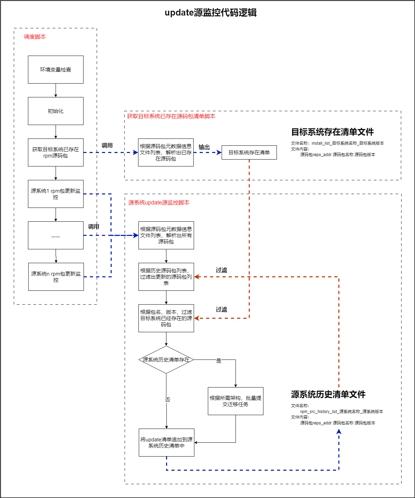
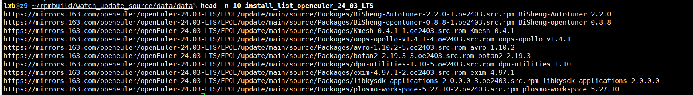
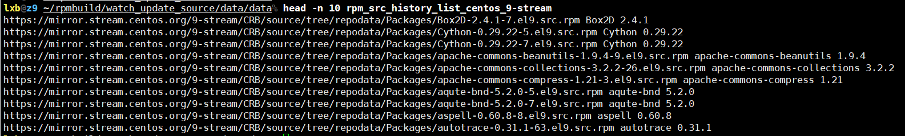

# 1 update源仓监控

> autospec包迁移，是将autospec服务器上存在的rpm源码包进行重新迁移构建，并提交至z9的源仓库.

## 1.1 流程图



## 1.2 脚本说明

### 1.2.1 调度脚本

- **脚本名称**：task_crontab.sh
- **功能描述**：
  - **项目环境初始化**：检查环境遍历，以及准备工作环境
  - **目标系统源码清单**：根据config/repo_cfg.sh配置的源仓源码包元数据信息文件列表获取目标系统全量源码包清单，并作为过滤数据；
  - **源系统update监控**：根据config/repo_cfg.sh配置的源仓源码包元数据信息文件列表获取源系统全量源码包清单，并使用源系统历史清单过滤（获取的记录不在源系统历史清单中，则表示当前更新的包）得到update清单；再使用目标系统全量源码包清单过滤update清单（过滤掉目标系统已经存在的包），得到最终的update待迁移清单，并进行迁移；

#### 1.2.1.1 使用说明

- **执行说明**
  - 配置文件：
    - watch_update_source/config/repo_cfg.sh：其中指定变量代表的rpm源码仓元数据信息文件列表

- **手动设定参数**

    ```shell
    # 当前项目数据存放路径
    export RPM_WATCH_PROJECT_PATH="${HOME}/rpmbuild/watch_update_source"

    # 以下数据会根据RPM_WATCH_PROJECT_PATH自行设定
    # 系统数据
    export RPM_WATCH_PROJECT_DATA_OS_PATH="${RPM_WATCH_PROJECT_PATH}/data/os"
    # 需持久保存的数据
    export RPM_WATCH_PROJECT_DATA_DATA_PATH="${RPM_WATCH_PROJECT_PATH}/data/data"
    # 日志路径
    export RPM_WATCH_PROJECT_LOG_PATH="${RPM_WATCH_PROJECT_PATH}/log"

    # 当前项目执行，输出的日志文件
    export project_log_file="${RPM_WATCH_PROJECT_LOG_PATH}/log_crontab_task"
    ```

#### 1.2.1.2 输入

***无参数输入***

#### 1.2.1.3 输出

***调度的功能脚本存在输出，详细请见后续***

### 1.2.2 获取目标系统已存在源码包清单脚本

- **脚本名称**：sub_task_proc_des_os_rpm_list.sh
- **功能描述**：根据config/repo_cfg.sh配置的源仓源码包元数据信息文件列表获取目标系统全量源码包清单，将作为过滤数据；

#### 1.2.2.1 使用说明

- **执行说明**
  无

#### 1.2.2.2 输入

   ```text
    # 各参数需要严格统一，查询数据文件时，会使用的
    参数1: 系统名称.  例如：openeuler
    参数2: 源系统版本.  例如：24.03-LTS
    参数3: rpm源码仓库地址.  例如："https://xx https://yy"
  ```

#### 1.2.2.3 输出

1. **目标系统已存在源码包清单文件**
   - **文件名称**：

      ```text
      install_list_目标系统名称_目标系统版本
      ```

   - **内容格式**：

      ```text
      源码包repo_addr 源码包名称 源码包版本
      ```

   - **文件存放路径**：${RPM_WATCH_PROJECT_PATH}/data/data/

   - **文件样例**：
      

### 1.2.3 源系统update源监控脚本

- **脚本名称**：sub_task_proc_update_rpm.sh
- **功能描述**：
  - **源系统全量源码包清单**：根据config/repo_cfg.sh配置的源仓源码包元数据信息文件列表获取源系统全量源码包清单；
  - **过滤源系统历史源码包**：使用源系统历史清单过滤已经处理过的源码包，得到update清单；（获取的记录不在源系统历史清单中，则表示当前更新的包）
  - **过滤目标系统存在源码包**：使用目标系统全量源码包清单过滤update清单（过滤掉目标系统已经存在的包），得到最终的update待迁移清单；
  - **批量迁移**：使用submit-repair.sh脚本批量迁移源码包；
  - **更新源系统历史清单**：将update待迁移清单追加到源系统历史清单，供后续update源过滤使用；

#### 1.2.3.1 使用说明

- **执行说明**
  无

#### 1.2.3.2 输入

   ```text
    # 各参数需要严格统一，查询数据文件时，会使用的
    参数1:源系统名称.  例如：centos
    参数2: 源系统版本.  例如：9-stream
    参数3: 目标系统名称.  例如：openeuler
    参数4: 目标系统版本.  例如：24.03-LTS
    参数5: rpm源码包仓库地址.  例如："https://xx https://yy"
  ```

#### 1.2.3.3 输出

1. **源系统历史清单文件**
   - **文件名称**：

      ```text
      rpm_src_history_list_源系统名称_源系统版本
      ```

   - **内容格式**：

      ```text
      源码包repo_addr 源码包名称 源码包版本
      ```

   - **文件存放路径**：${RPM_WATCH_PROJECT_PATH}/data/data/

   - **文件样例**：
      