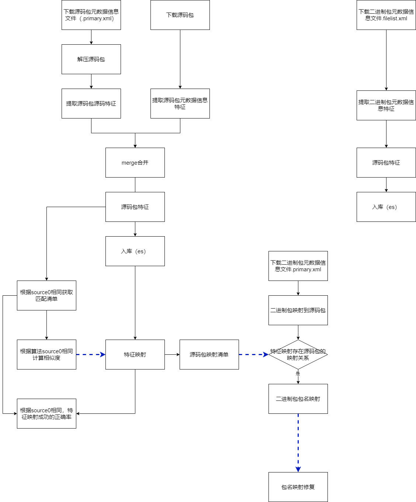

# 1 包名映射

## 1.1 流程图

## 1.2 脚本说明

### 1.3.1 下载

> 注意：
>
> 1. 如果存在已经下载的源仓，则对应的元数据文件最好从下载的源仓路径中去拿；
> （因为官方源仓是在不断更新的，与已下载的源仓数据（源码包、元数据信息文件）存在时间差异，即已下载的源码包和官方最新的元数据信息文件是不完美匹配的）；
> 2. 需自行下载的源仓列表需要根据个人需要进行更新；

- 下载源码包，可参考：get_package/download-openeuler-src.sh
- 下载元数据信息文件，可参考：get_package/download-openeuler-xml.sh

### 1.3.2  解压

> 注意：
>
> 1. 可能存在自行下载的源仓、已下载的源仓，两个都需要解压；

- 解压参考：unzip_package/unzip_openeuler_openEuler-24.03-LTS.sh

### 1.3.3 特征提取

- 源码特征：feature_extract/extract_spec.py
- 源码元数据特征：feature_extract/extract_rpm.py
- 二进制元数据特征：feature_extract/extract_bin.py

### 1.3.4 源码特征合并

> 源码特征合并：源码特征、源码元数据特征

- 合并脚本：merge_json.py

### 1.3.5 特征入库

> 特征入库是指，将某各系统（版本）对应的源码特征和二进制特征进行入库

### 1.3.6 source0相同清单

- 存在source0相同的包原系统包名清单：utils/match-rpm-name-source.py
- 直接获取source0相同的包匹配清单：utils/match-rpm-name-source-name_to_name.py

### 1.3.6 相似度阈值计算

> 在source0相同的情况下，计算对应源码包之间的相似度

代码：package_mapping/similarity_calculator-new.py

### 1.3.7 特征映射

> 1. 将计算出的相似度阈值，设置到配置文件中
> 2. 根据不同的相似度计算算法，进行源码包映射

代码：pkg_mapping.py

### 1.3.8 特征映射征确率

> 在source0相同情况下，存在包名映射的正确率

正确率检查：utils/check-correct-rate-same-source.py

### 1.3.9 二进制包名映射

> 1. 需要下载二进制包的元数据信息文件（.primary.xml），用于获取二进制包对应的源码包；
> 2. 二进制包根据源码包的特征映射关系，完成源系统、目标系统的二进制包名映射

二进制包映射：utils/rpm-binary-match-binary.py

#### 1.3.10 包名映射修复
 ***详细请见lkp-tests***

## 1.3 其他

### 1.3.1 可能遇见问题

1. 问题1："elasticsearch.UnsupportedProductError: The client noticed that the server is not Elasticsearch and we do not support this unknown product"
   - 可能是elasticsearch的版本和es数据库版本不一致造成的（降低安装的es包版本）
 

2. 问题2："fastembed.common.model_management:download_model:248 - Could not download model from HuggingFace: An error happened while trying to locate the files on the Hub and we cannot find the appropriate snapshot folder for the specified revision on the local disk. Please check your internet connection and try again. Falling back to other sources."
   - 问题解决：表示下载模型失败， 则需要提前设置环境变量 "HF_ENDPOINT"（代码执行之前）
