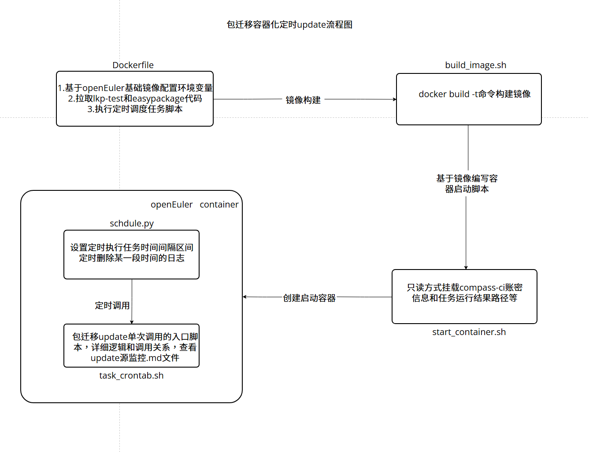

# 包迁移容器化定时update

### 流程图

### 脚本说明

#### Dockerfile文件
**作用：用于构建一个基于OpenEuler 22.03 LTS的Docker镜像，其主要功能是设置环境、安装所需的依赖包、克隆相关的代码库，并准备运行一个Python脚本**

1. 使用OpenEuler 22.03 LTS作为基础镜像，并命名为 BUILDER 阶段
2. 设置工作目录为 /root，后续所有命令将在此目录下执行
3. 使用 sed 命令修改 openEuler.repo 文件，以更换软件源为南京大学的镜像。，删除了与 metalink 和 metadata_expire 相关的行，以优化yum的配置。
4. 设置多个环境变量： 扩展 PATH 环境变量以包含LKP相关的可执行文件路径。 设置Python包安装的源为阿里云的PyPI镜像，以加速安装
5. 安装了一系列开发工具和库，克隆两个 Git 仓库，一个是 LKP-test代码，另一个是 EasyPackages 项目
6. 切换到 EasyPackages 项目的特定工作目录,启动指定的 Python 脚本 schdule.py

#### build_image.sh
**作用：通过Dockerfile文件，构建定制化的用于包迁移定时update的容器镜像**

1. 使用当前工作目录中的Dockerfile构建一个名为 openeuler-package-migration-update 的Docker镜像

#### start_container.sh
**作用：基于定制化的用于包迁移定时update的容器镜像，创建并启动容器实例**

1. 定义环境变量：设置 CCI_SRC 为 /c/compass-ci，指定 Compass CI 的源目录
2. 加载配置文件：使用 source 命令加载 defconfig.sh 脚本，以获取必要的变量和函数
3. 删除现有容器：调用 docker_rm 函数，删除名为 openeuler-package-update 的Docker容器
4. 加载默认设置和认证信息：调用 load_cci_defaults 和 load_service_authentication 函数，设置默认配置和服务认证信息
5. 构建 Docker 运行命令：定义一个数组 cmd，包含运行 Docker 容器所需的各项参数，包括容器名称、运行模式、挂载的卷等
6. 执行 Docker 命令：最后，通过 "${cmd[@]}" 执行之前构建的 Docker 命令，以启动新的容器

#### schdule.py
**作用：实现了一个定时任务调度程序，它每天凌晨2点自动执行一个Shell脚本，并确保在执行过程中不会有同名进程同时运行。同时，它还会管理和清理相关的日志文件（超过30天的）**

1. 主循环：通过 while True 循环不断运行调度器，使其检查并运行待执行的任务，每秒钟检查一次
2. 定时任务调度：使用 schedule 模块设置一个每天凌晨2点执行 run_shell_script 函数的任务
3. 检查进程是否在运行 (check_process_running 函数)：使用 subprocess.run() 执行命令 ps -ef 来获取当前所有正在运行的进程，遍历进程输出，判断指定的脚本名称是否存在于其中。如果脚本正在运行，则返回 True，否则返回 False。
4. 运行Shell脚本 (run_shell_script 函数)：构建要执行的Shell脚本的路径（task_crontab.sh），调用 check_process_running 函数检查相应的Shell脚本是否已经在运行，如果脚本没有在运行，则使用 subprocess.Popen() 启动Shell脚本，并打印成功消息；如果脚本已在运行，则输出提示信息。

#### task_crontab.sh
**作用：依赖于外部配置和库脚本的支持，以及一些环境变量的正确设置。它结合了多个子任务脚本来完成监控和迁移RPM包的功能**

1. 检查环境变量：判断 RPM_WATCH_PROJECT_PATH 是否为空，如果是，输出错误信息并结束。如果不是，继续执行
2. 初始化项目：创建必要的目录（数据和日志路径）
3. 记录当前时间和任务开始日志：调用 外部脚本的方法：log_msg 记录当前时间和启动信息
4. 生成openEuler的清单：执行 sub_task_proc_des_os_rpm_list.sh，传入相关参数
5. 监控CentOS9的源更新：执行 sub_task_proc_update_rpm.sh，传入 CentOS9 的相关参数
6. 监控Fedora40的源更新：执行 sub_task_proc_update_rpm.sh，传入 Fedora40 的相关参数

#### repo_cfg.sh（配置脚本）
**作用：配置脚本：统一管理，定义了三个数组，分别存储了 OpenEuler 24.03 LTS、CentOS 9 和 Fedora 40 的源 XML 文件 URL 列表。每个数组包含一系列指向不同软件源
（例如主仓库、更新和测试仓库）中 repodata/repomd.xml 文件的链接。（这些 XML 文件通常用于软件包管理器获取相应软件包的信息）**

**详细说明：**
1. OpenEuler 24.03 LTS:定义了一个数组 src_xml_url_openeuler_24_03_LTS，包含 5 个 URL，指向 OpenEuler 24.03 LTS 的主软件源及其更新源的元数据文件。
2. CentOS 9:定义了一个数组 src_xlm_url_centos_9，包含 8 个 URL，指向 CentOS 9 流的多个源，包括 AppStream、BaseOS、CRB 及 EPEL (Extra Packages for Enterprise Linux) 的不同版本。
3. Fedora 40:定义了一个数组 src_xlm_url_fedora_40，包含 6 个 URL，指向 Fedora 40 的各种软件源，包括更新源和正式发布源。

#### lib_rpm.sh（工具脚本）
**作用：定义了一系列公共脚本方法，方便其他脚本source引用**

**详细说明：**
* 日志记录函数 (log_msg)

- **输入**: 
  - 一条消息字符串（例如，`"这是一个日志消息"`）。
  
- **输出**: 
  - 将消息打印到控制台。
  - 如果设置了 `project_log_file` 环境变量，将消息写入指定的日志文件。
  - 若日志文件目录不存在，则尝试创建它。

* 文件解压函数 (file_uncompress)

- **输入**:
  - 第一个参数：待解压的文件路径（例如，`"/path/to/archive.tar.gz"`）。
  - 第二个参数：解压目标目录（例如，`"/path/to/destination"`）。

- **输出**: 
  - 解压缩后的文件将存放在指定的目标目录中。
  - 如果解压失败，会通过日志记录错误信息。

* 下载主 XML 的函数 (download_primary_xml_by_repomdxml)

- **输入**:
  - 第一个参数：`repomd.xml` 文件的 URL（例如，`"http://example.com/repodata/repomd.xml"`）。
  - 第二个参数：保存下载文件的目录（例如，`"/path/to/save"`）。

- **输出**:
  - 下载的 `primary.xml.gz` 或 `primary.xml` 文件（如果存在），下载后会自动解压至指定目录。
  - 如果下载或解析过程中出现问题，会在日志中记录错误信息。

* 下载源主 XML 的函数 (download_source_primary_xml)

- **输入**:
  - 一个包含多个 URL 的数组（例如，`("http://example.com/repo1" "http://example.com/repo2")`）。

- **输出**:
  - 成功下载的所有主 XML 文件的列表，以及它们被保存的路径。
  - 会清理旧的 XML 文件，并在日志中记录每一步的操作情况。

#### sub_task_proc_des_os_rpm_list.sh
**作用：根据src_xlm_urls, 生成二进制包列表，主要生成openEuler的二进制列表，表示已安装的包，用于过滤作用**

1. 导入依赖模块:source 命令用于引入外部的 Bash 脚本（lib_rpm.sh），其中可能包含一些函数或变量，以供当前脚本使用。
2. 参数检查：检查输入的参数数量是否为 3。如果不是，则打印错误信息并退出脚本
3. 环境变量检查:确保环境变量 RPM_WATCH_PROJECT_DATA_OS_PATH 和 RPM_WATCH_PROJECT_DATA_DATA_PATH 已定义。如果没有定义，打印相应的错误信息并退出
4. 参数赋值:将传入的参数分别赋值给变量 os_name、os_version 和 src_xlm_urls
5. 路径构建:根据之前定义的环境变量和参数构建目标文件和目录的路径
6. 日志记录：调用 log_msg 函数记录处理信息，表明正在处理特定操作系统及其版本
7. 下载源码包信息：调用 download_source_primary_xml 函数，下载与源系统版本相关的源码包信息
8. 复制安装列表：将下载得到的安装列表从 base_path 复制到最终指定的 rpm_install_list 路径中，确保生成的安装列表可供后续使用

**输入输出说明**

- **输入**:
  - 第一个参数：系统名称.  例如：openEuler。
  - 第二个参数：源系统版本.  例如：24.03-LTS。
  - 第三个参数：rpm源码仓库地址.  例如："https://mirrors.163.com/openeuler/openEuler-24.03-LTS/EPOL/main/source/repodata/repomd.xml https://yy"
- **输出**:
  - rpm_install_list 路径中，生成的安装列表。

#### sub_task_proc_update_rpm.sh
**作用：从源系统获取RPM包列表，通过对比openEuler软件包清单和已经提交过的历史清单过滤出需要构建的rpm包清单后，提交批量迁移任务，将提交的清单追加写到历史清单中**

1. 参数检查：检查输入的参数数量是否为 5。如果不是，则打印错误信息并退出脚本
2. 环境变量检查:检查必要的环境变量是否已定义，包括日志路径、操作系统数据路径等，缺少任何一个都会导致脚本退出
3. 变量赋值与目录构建：从输入参数中获取源系统和目标系统的信息，并构建相关的路径
4. 历史文件备份：如果存在之前的源码包列表文件，进行时间戳备份，以避免数据丢失。同样，如果没有 base_path 目录，则创建它
5. 下载源码包信息：调用download_source_primary_xml函数下载指定源码包的信息，形成新的源码包列表
6. 过滤历史包和已安装包：先通过 filter_src_rpm_by_file 函数过滤掉历史记录中的包，然后再通过读取已安装包的列表进行二次过滤，只保留未安装且不在历史列表中的源码包
7. 提交批量迁移任务：如果历史文件存在，准备提交迁移任务。循环遍历架构类型（例如 aarch64, x86_64），构造命令并调用其他脚本 (submit-repair.sh) 进行批量处理。每个提交操作的日志路径也会被记录
8. 保存到历史列表:将当前处理的源码包列表追加到历史列表中，以便下次操作时进行参考

**输入输出说明**

- **输入**:
  - 第一个参数：源系统名称（需要迁移的源操作系统的名称）.  例如：centos
  - 第二个参数：源系统版本（源操作系统的具体版本号）.  例如：9-stream
  - 第三个参数：目标系统名称（将要迁移到的目标操作系统的名称）. 例如：openeuler
  - 第四个参数：目标系统版本（目标操作系统的具体版本号）. 例如：24.03-LTS
  - 第五个参数： 源系统RPM 源码包仓库地址（包含源码包信息的 URL 列表，以空格分隔，在repo_cfg.sh中获取）. 例如："https://xx https://yy"
- **输出**:
  - 日志文件:程序在执行过程中会生成日志，记录操作的详细信息，包括错误、处理步骤及提交任务的信息。日志路径由 RPM_WATCH_PROJECT_LOG_PATH 环境变量指定
  - 备份文件:如果存在历史的 RPM 源码包列表，会在 bak_path 目录下生成以时间戳命名的备份文件，以避免数据丢失
  - 新的 RPM 源码包列表:最终生成的需要迁移的 RPM 源码包列表文件位于 rpm_src_list 路径下，格式为:repo_addr rpm_name rpm_version
  - 历史包列表:当前处理的 RPM 源码包列表会被追加到历史列表（rpm_src_history_list），用于未来的过滤和参考
  - 提交任务结果:提交任务的执行结果

#### submit-repair.sh
**作用：用于批量提交submit任务的脚本，详细参数和逻辑输入输出查看该脚本自带注释介绍和代码**

### 使用说明

1. z9环境克隆github代码需要添加代理，克隆easypackages最新代码仓到本地（git clone https://ghp.ci/https://github.com/opensourceways/easypackages.git）
2. 切换到easypackages/easypackages/watch_update_source下，执行命令：bash build_image.sh构建镜像
3. 执行同级目录下的脚本start_container.sh，执行命令： bash start_container.sh创建并启动容器
4. 执行docker exec -it openeuler-package-update /bin/bash进入容器，查看执行情况和日志记录
5. 容器内日志查看路径：/root/easypackages/easypackages/watch_update_source/log
6. 日志命名是以：迁移系统名字+迁移架构+迁移日期保留的文件夹：如图

7. 进入其中一个日志文件，result_root_list：保留了当前提交job任务的所有的结果路径。submit-log：记录提交这批任务的提交记录。submit-succ-list：记录提交成功任务清单。submit-fail-list：记录提交失败的任务清单（如果有失败的才会生成这个文件）
8. 对这些日志想要清晰了解，可以查看rpm_package_transfer目录下的rpm_package_transfer流程图.png
