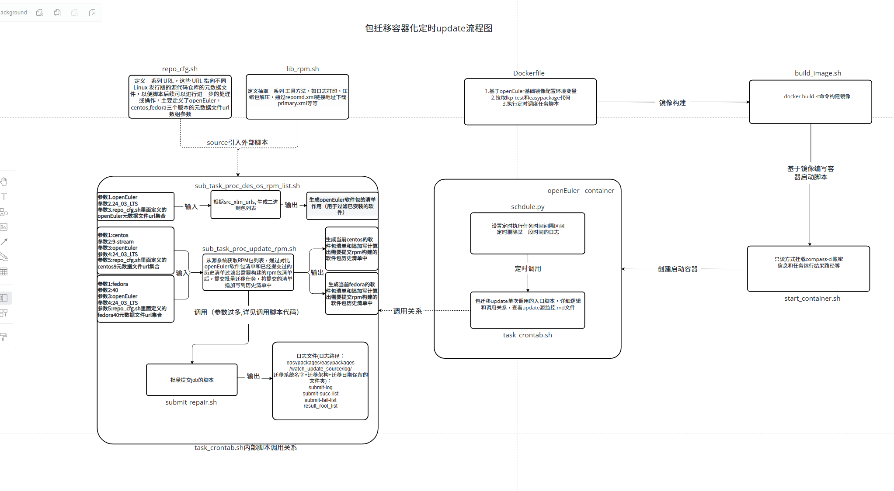

# 包迁移容器化定时update

### 流程图

### 脚本说明

#### Dockerfile文件
**作用：用于构建一个基于OpenEuler 22.03 LTS的Docker镜像，其主要功能是设置环境、安装所需的依赖包、克隆相关的代码库，并准备运行一个Python脚本**

1. 使用OpenEuler 22.03 LTS作为基础镜像，并命名为 BUILDER 阶段
2. 设置工作目录为 /root，后续所有命令将在此目录下执行
3. 使用 sed 命令修改 openEuler.repo 文件，以更换软件源为南京大学的镜像。，删除了与 metalink 和 metadata_expire 相关的行，以优化yum的配置。
4. 设置多个环境变量： 扩展 PATH 环境变量以包含LKP相关的可执行文件路径。 设置Python包安装的源为阿里云的PyPI镜像，以加速安装
5. 安装了一系列开发工具和库，克隆两个 Git 仓库，一个是 LKP-test代码，另一个是 EasyPackages 项目
6. 切换到 EasyPackages 项目的特定工作目录,启动指定的 Python 脚本 schdule.py

#### build_image.sh
**作用：通过Dockerfile文件，构建定制化的用于包迁移定时update的容器镜像**

1. 使用当前工作目录中的Dockerfile构建一个名为 openeuler-package-migration-update 的Docker镜像

start_container.sh
**作用：基于定制化的用于包迁移定时update的容器镜像，创建并启动容器实例**

1. 定义环境变量：设置 CCI_SRC 为 /c/compass-ci，指定 Compass CI 的源目录
2. 加载配置文件：使用 source 命令加载 defconfig.sh 脚本，以获取必要的变量和函数
3. 删除现有容器：调用 docker_rm 函数，删除名为 openeuler-package-update 的Docker容器
4. 加载默认设置和认证信息：调用 load_cci_defaults 和 load_service_authentication 函数，设置默认配置和服务认证信息
5. 构建 Docker 运行命令：定义一个数组 cmd，包含运行 Docker 容器所需的各项参数，包括容器名称、运行模式、挂载的卷等
6. 执行 Docker 命令：最后，通过 "${cmd[@]}" 执行之前构建的 Docker 命令，以启动新的容器

#### schdule.py
**作用：实现了一个定时任务调度程序，它每天凌晨2点自动执行一个Shell脚本，并确保在执行过程中不会有同名进程同时运行。同时，它还会管理和清理相关的日志文件（超过30天的）**

1. 主循环：通过 while True 循环不断运行调度器，使其检查并运行待执行的任务，每秒钟检查一次
2. 定时任务调度：使用 schedule 模块设置一个每天凌晨2点执行 run_shell_script 函数的任务
3. 检查进程是否在运行 (check_process_running 函数)：使用 subprocess.run() 执行命令 ps -ef 来获取当前所有正在运行的进程，遍历进程输出，判断指定的脚本名称是否存在于其中。如果脚本正在运行，则返回 True，否则返回 False。
4. 运行Shell脚本 (run_shell_script 函数)：构建要执行的Shell脚本的路径（task_crontab.sh），调用 check_process_running 函数检查相应的Shell脚本是否已经在运行，如果脚本没有在运行，则使用 subprocess.Popen() 启动Shell脚本，并打印成功消息；如果脚本已在运行，则输出提示信息。

### 使用说明

1. z9环境克隆github代码需要添加代理，克隆easypackages最新代码仓到本地（git clone https://ghp.ci/https://github.com/opensourceways/easypackages.git）
2. 切换到easypackages/easypackages/watch_update_source下，执行命令：bash build_image.sh构建镜像
3. 执行同级目录下的脚本start_container.sh，执行命令： bash start_container.sh创建并启动容器
4. 执行docker exec -it openeuler-package-update /bin/bash进入容器，查看执行情况和日志记录
5. 容器内日志查看路径：/root/easypackages/easypackages/watch_update_source/log
6. 日志命名是以：迁移系统名字+迁移架构+迁移日期保留的文件夹：如图

7. 进入其中一个日志文件，result_root_list：保留了当前提交job任务的所有的结果路径。submit-log：记录提交这批任务的提交记录。submit-succ-list：记录提交成功任务清单。submit-fail-list：记录提交失败的任务清单（如果有失败的才会生成这个文件）
8. 对这些日志想要清晰了解，可以查看rpm_package_transfer目录下的rpm_package_transfer流程图.png
